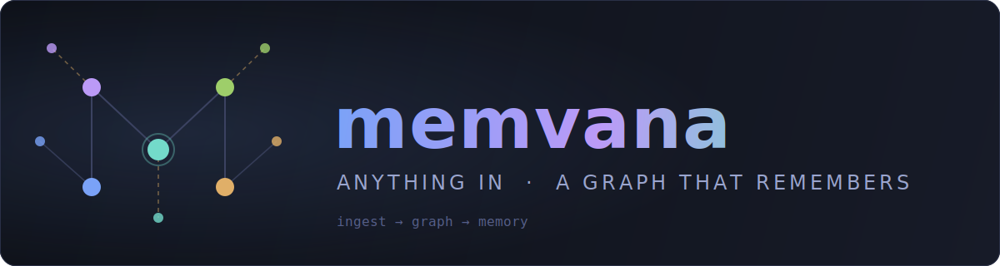

<p align="center">
  
</p>

# Memvana

[](https://github.com/rameshio/memvana/actions/workflows/ci.yml)
[](LICENSE)

**Universal ingestion → knowledge graph → persistent memory. One tool that turns anything into a queryable graph that remembers.**

Memvana combines the three jobs you normally need three separate tools for:

| Job | Inspired by | What Memvana does |
|-----|-------------|-------------------|
| Ingest anything | [MarkItDown](https://github.com/microsoft/markitdown) | Converts PDF, Word, PowerPoint, Excel, HTML, images, audio, code, and more into clean Markdown |
| Understand it | [Graphify](https://github.com/Graphify-Labs/graphify) | Builds a knowledge graph — documents, sections, modules, classes, functions, concepts — with `query`, `path`, and `explain` commands |
| Remember it | [claude-mem](https://github.com/thedotmack/claude-mem) | Persistent, searchable memory across sessions, with Claude Code hooks that inject past context automatically |

Everything runs **locally**. Code and Markdown analysis is fully deterministic — no LLM, no API calls, nothing leaves your machine.

## Install

**One command** (CLI + Claude Code skill together):

```bash
# macOS / Linux / Git Bash
curl -fsSL https://raw.githubusercontent.com/rameshio/memvana/main/install.sh | bash
```

```powershell
# Windows PowerShell
irm https://raw.githubusercontent.com/rameshio/memvana/main/install.ps1 | iex
```

Or just the Python package:

```bash
pip install "memvana[all] @ git+https://github.com/rameshio/memvana"
```

### For AI agents

If you are an AI assistant asked to install Memvana from this repository,
follow these steps exactly:

1. Install the CLI: `pip install "memvana[all] @ git+https://github.com/rameshio/memvana"`
2. Install the skill file: download
   `https://raw.githubusercontent.com/rameshio/memvana/main/SKILL.md`
   into your host's skills directory — for Claude Code that is
   `~/.claude/skills/memvana/SKILL.md`; for other assistants use their
   equivalent rules/skills location.
3. Verify with `memvana --version`, then tell the user to restart their
   session so the skill loads.

## Quick start

```bash
cd your-project

# 1. Ingest everything and build the knowledge graph
memvana build .

# 2. Ask the graph questions
memvana query PaymentService
memvana path checkout.py DatabasePool     # how are these two connected?
memvana explain validate_user             # everything around one node

# 3. Explore visually (self-contained HTML, no internet needed)
memvana html

# 4. Remember things across sessions
memvana remember "Chose Postgres over MySQL for JSONB support" --tags decision
memvana recall postgres

# 5. Or ask everything at once — graph and memory in a single answer
memvana ask payment
```

Add individual files or web pages anytime — any format:

```bash
memvana ingest design-spec.pdf meeting-notes.docx architecture.png
memvana ingest https://example.com/architecture-blog-post
```

Rebuilds are incremental: unchanged files are detected by content hash and skipped, so re-running `memvana build .` after editing one file only reconverts that file.

## How it works

```
 anything          .memvana/                queryable
┌─────────┐      ┌────────────────┐       ┌──────────────┐
│ PDF     │      │ documents/*.md │       │ query        │
│ Office  │ ───► │ graph.json     │  ───► │ path         │
│ HTML    │      │ memory.db      │       │ explain      │
│ images  │      └────────────────┘       │ recall       │
│ audio   │       one workspace,          │ graph.html   │
│ code    │       all persistent          └──────────────┘
└─────────┘
```

1. **Ingest** — text and code are read directly; rich formats go through MarkItDown. Everything is stored as Markdown in `.memvana/documents/`.
2. **Graph** — Markdown structure (headings, links, `[[wiki-links]]`, **bold concepts**), Python code (imports, classes, functions, calls, inheritance via AST), and JavaScript/TypeScript (imports, functions, classes) become nodes and edges. Every edge is tagged **extracted** (stated in the source) or **inferred** (derived by name resolution or co-occurrence), so you always know how much to trust a connection. Communities are detected by label propagation.
3. **Memory** — observations live in SQLite with FTS5 full-text search. `recall` returns a compact index first (cheap); `show <id>` fetches full content only when needed — progressive disclosure keeps context token-efficient for AI agents. Anything wrapped in `<private>...</private>` is stripped before it ever reaches disk.

## Claude Code integration

### Install as a skill (recommended)

The repo doubles as a skill: [SKILL.md](SKILL.md) sits at the root, so
cloning it into your skills directory is the whole install. Claude then
activates Memvana **automatically** — drop a PDF into chat, ask "how does X
connect to Y", or say "remember this decision", and Claude uses Memvana on
its own:

```bash
pip install "memvana[all]"
git clone --depth 1 https://github.com/rameshio/memvana ~/.claude/skills/memvana
```

Skill managers that install from a GitHub URL (e.g. `<tool> skills install
https://github.com/rameshio/memvana`) work the same way, since `SKILL.md`
is at the repo root.

### Automatic session memory (hooks)

Give every Claude Code session persistent memory by wiring three hooks into `.claude/settings.json`:

```json
{
  "hooks": {
    "SessionStart": [{ "hooks": [{ "type": "command", "command": "memvana hook session-start" }] }],
    "PostToolUse":  [{ "hooks": [{ "type": "command", "command": "memvana hook post-tool" }] }],
    "SessionEnd":   [{ "hooks": [{ "type": "command", "command": "memvana hook session-end" }] }]
  }
}
```

On session start, Memvana prints recent memory as context. During the session it records what the agent changes. Hooks never raise — a memory failure will never break your coding session.

## Command reference

| Command | Purpose |
|---------|---------|
| `memvana build [path]` | Ingest a directory and build the graph (incremental) |
| `memvana ingest <src...>` | Ingest files or URLs (any format) and update the graph |
| `memvana ask <term>` | Search graph **and** memory together |
| `memvana query <term>` | Search graph nodes |
| `memvana path <a> <b>` | Shortest connection between two things |
| `memvana explain <term>` | One node and everything connected to it |
| `memvana html [-o file]` | Export interactive graph viewer |
| `memvana remember <text>` | Store a memory (`--tags`, `--kind`) |
| `memvana recall <query>` | Search memories (`--full`, `--limit`) |
| `memvana show <id>` | Full content of one memory |
| `memvana sessions` | List memory sessions |
| `memvana status` | Workspace statistics |
| `memvana hook <event>` | Claude Code hook endpoint |

## Development

```bash
git clone https://github.com/rameshio/memvana
cd memvana
python -m venv .venv && .venv/Scripts/activate    # Windows
pip install -e ".[dev]"
pytest
```

## License

[MIT](LICENSE)
